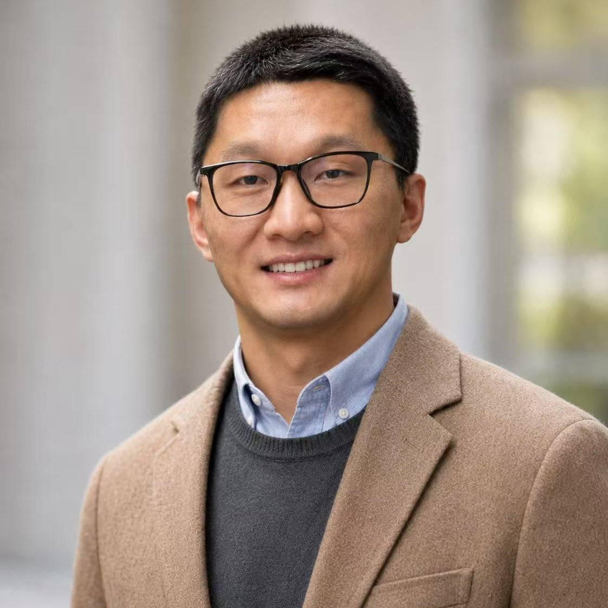

## Principle Investigator

::: {.box}

:::: {.columns}

::: {.column width="22%"}

::: {.profile-photo}

:::

:::

::: {.column width="78%"}

#### [Daoguan Ning](https://burnningresearch.github.io/)  

Assistant Professor  
Department of Mechanical Engineering and Engineering Science  
University of North Carolina, Charlotte

::: {.pub-links-row}
[Email](mailto:dning@charlotte.edu){.pub-link}
[Scholar](https://scholar.google.com/citations?user=189buh4AAAAJ&hl=en){.pub-link}
[ResearchGate](https://www.researchgate.net/profile/Daoguan-Ning){.pub-link}
[LinkedIn](https://www.linkedin.com/in/daoguan-ning-71b579246/){.pub-link}
[C.V.](people_files/PI/Daoguan_CV_en.pdf){.pub-link}
:::

:::

::::

:::

## Graduate Students

::: {.box}
### Adaptive Robot Policies

How can robot policies adapt dynamically at inference time to handle new
tasks, environments, and embodiment variations?
:::

::: {.box}
### Interactive World Models

How can structured world models help agents anticipate spatial, temporal,
and physical interactions before acting?
:::

::: {.box}
### Proactive Self-Improvement

How can agents verify and learn from their own predictions to improve
continually with minimal human supervision?
:::

## Undergraduate Students

::: {.box}
### Proactive Self-Improvement

How can agents verify and learn from their own predictions to improve
continually with minimal human supervision?
:::

## Research Staff

::: {.box}
### Proactive Self-Improvement

How can agents verify and learn from their own predictions to improve
continually with minimal human supervision?
:::

## Visiting Scholars

::: {.box}
### Adaptive Robot Policies

How can robot policies adapt dynamically at inference time to handle new
tasks, environments, and embodiment variations?
:::

## Alumni

::: {.box}

::: {.list-clean}
<!-- - [Xilun Zhang](https://xilunzhangrobo.github.io/) [·]{.member-role} [MSc, CMU → PhD, Stanford]{.member-role} -->
:::
:::

##
::: {.text-center style="font-size:0.75rem; color:#111; margin-top:2rem;"}
© 2026 EMC2 Lab. All rights reserved.
:::
