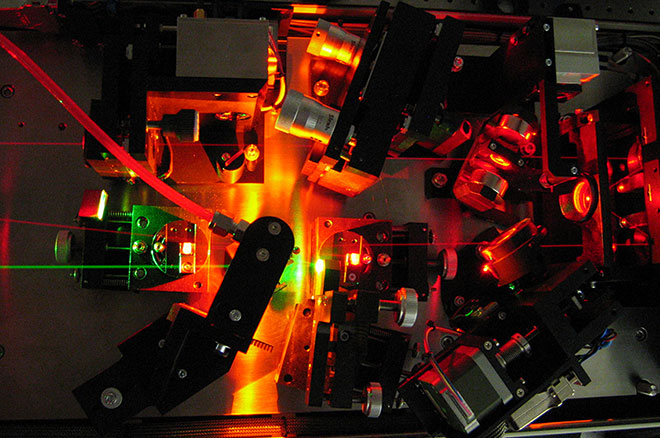
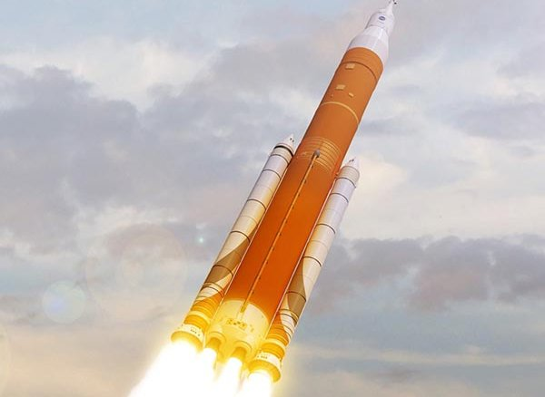

::: {.text-center style="margin-top:-1rem;"}
# EMC2 Laboratory

Energy
Material
Conversion and
Combustion

<!--*Department of Mechanical Engineering and Engineering Science*  
*University of North Carolina at Charlotte*-->

:::

## Welcome
::: {.hero}
Welcome to the EMC2 Lab at UNC Charlotte. We are interested in understanding, designing, and optimizing multi-phase, mutli-scale, thermochemically reacting systems to enable next-generation energy, propulsion, and critical materials technologies. We utilize both experimental and modeling approaches, ranging from lab-scale tests and quantitative diagnostics to computer-assitsted theoretical modeling, to reveal fundmental physcial and chemical mechanisms controlling key process in these systems. 

:::

## Open Positions

::: {.box}
We welcome PhD students, postdoctoral researchers, and visiting students
interested in developping next-generation energy，propulsion, and sustainable material processing technology based on fundemental mechanism, unrevealed through experimetal, theoretical, and computational approches.

[Join Us — 2 PhD Openings, Apply by Dec 15](https://burnningresearch.github.io/Openning.html){.btn-app}
:::

## Research Directions

We study thermochemical processes enabling sustainbable enegy converstion, high-performance propulsion, and critical material recycling by devlopping and utilizing advanced experimental and numerical methods.

::: {.box-grid-3}

::: {.box}

::: {.text-center}
### Advanced Optical Dignostics
:::

::: {.research-figure}

:::

:::

::: {.box}

::: {.text-center}
### Critical Material Recycling
:::

::: {.research-figure}

:::

:::

::: {.box}

::: {.text-center}
### High-performance Propulsion
:::

::: {.research-figure}

:::

:::

:::

## Latest News

::: {.pub-list-wrap}

::: {.pub-list}

::: {.box .pub-entry}
::: {.pub-main}
#### EMC2 Lab was founded

::: {.pub-authors}
Daoguan Ning joins the Department of Mechanical Engineering and Engineering Science at the University of North Carolina, Charlotte as an Assistant Professor
:::

::: {.pub-venue}
Charlotte, **21 Jun. 2026**. # Lab Event
:::
:::

::: {.pub-links}
[Details]{.pub-link}
:::
:::

:::

:::

## Selected Publications

Below is a representative selection of recent publications. For the full
publication list, please refer to the
[Google Scholar](https://scholar.google.com/citations?hl=en&user=Xi-B5WIAAAAJ)
profile.

::: {.pub-list-wrap}

::: {.pub-list}

::: {.box .pub-entry}
::: {.pub-main}
#### Scaling Verification Can Be More Effective than Scaling Policy Learning for Vision-Language-Action Alignment

::: {.pub-authors}
Jacky Kwok, Xilun Zhang, Mengdi Xu, Yuejiang Liu, Azalia Mirhoseini, Chelsea Finn, Marco Pavone
:::

::: {.pub-venue}
ECCV, 2026. **Best Paper Finalist**, CVPR Scalable Robot Learning Workshop
:::
:::

::: {.pub-links}
[HTML](https://doi.org/10.1016/j.proci.2022.07.030){.pub-link} [PDF](/publications_files/papers/2022_Size_evolution.pdf){.pub-link} [Project](https://github.com/cover-vla/cover-vla){.pub-link}
:::
:::

::: {.box .pub-entry}
::: {.pub-main}
#### RoboMME: Benchmarking and Understanding Memory for Robotic Generalist Policies

::: {.pub-authors}
Yinpei Dai, Hongze Fu, Jayjun Lee, Yuejiang Liu, Haoran Zhang, Jianing Yang, Chelsea Finn, Nima Fazeli, Joyce Chai
:::

::: {.pub-venue}
International Conference on Machine Learning (ICML), 2026. **Oral (0.7%)**
:::
:::

::: {.pub-links}
[Paper](https://arxiv.org/abs/2603.04639){.pub-link} [Project](https://robomme.github.io/){.pub-link} [Code](https://github.com/RoboMME/robomme_benchmark){.pub-link}
:::
:::

::: {.box .pub-entry}
::: {.pub-main}
#### Learning Long-Context Diffusion Policies via Past-Token Prediction

::: {.pub-authors}
Marcel Torne, Andy Tang, Yuejiang Liu, Chelsea Finn
:::

::: {.pub-venue}
Conference on Robot Learning (CoRL), 2025. **Best Paper**, RSS Robot Representation Workshop
:::
:::

::: {.pub-links}
[Paper](https://arxiv.org/abs/2505.09561){.pub-link} [Project](https://long-context-dp.github.io/){.pub-link} [Code](https://github.com/long-context-dp/ldp){.pub-link}
:::
:::

::: {.box .pub-entry}
::: {.pub-main}
#### Demo-SCORE: Curating Demonstrations using Online Experience

::: {.pub-authors}
Annie Chen, Alec Lessing, Yuejiang Liu, Chelsea Finn
:::

::: {.pub-venue}
Robotics: Science and Systems (RSS), 2025
:::
:::

::: {.pub-links}
[Paper](https://arxiv.org/abs/2503.03707){.pub-link} [Preprint](https://anniesch.github.io/demo-score/){.pub-link} [Code](https://github.com/alessing/demo-score){.pub-link}
:::
:::

::: {.box .pub-entry}
::: {.pub-main}
#### Bidirectional Decoding: Improving Action Chunking via Guided Test-Time Sampling

::: {.pub-authors}
Yuejiang Liu, Jubayer Ibn Hamid, Annie Xie, Yoonho Lee, Max Du, Chelsea Finn
:::

::: {.pub-venue}
International Conference on Learning Representations (ICLR), 2025
:::
:::

::: {.pub-links}
[Paper](https://arxiv.org/abs/2408.17355){.pub-link} [Project](https://bid-robot.github.io/){.pub-link} [Code](https://github.com/YuejiangLIU/bid_diffusion){.pub-link}
:::
:::

:::

:::

## Contact
::: {.box .contact-box}
**Email:** <dning@charlotte.edu>

**Address:** COM 1, 13 Computing Drive, Singapore 117417
:::

##
::: {.text-center style="font-size:0.75rem; color:#111; margin-top:2rem;"}
© 2026 EMC2 Lab. All rights reserved.
:::
